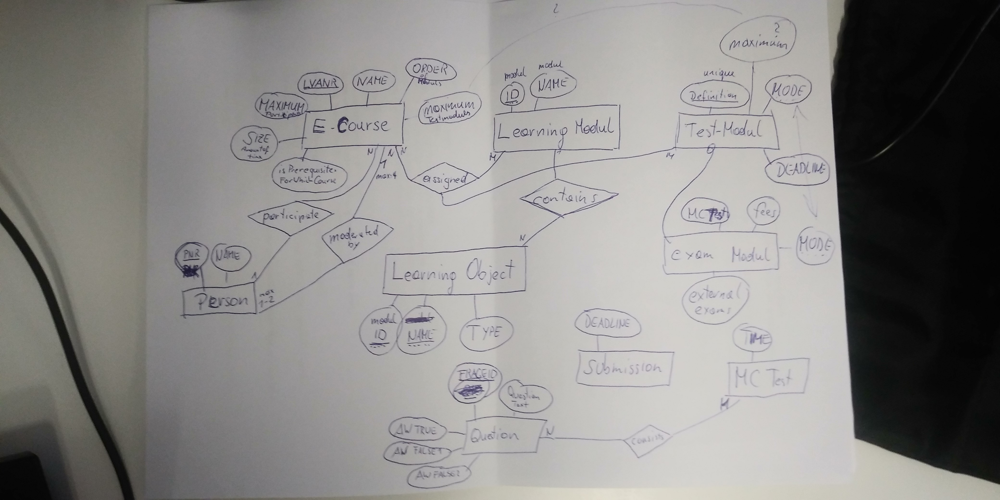
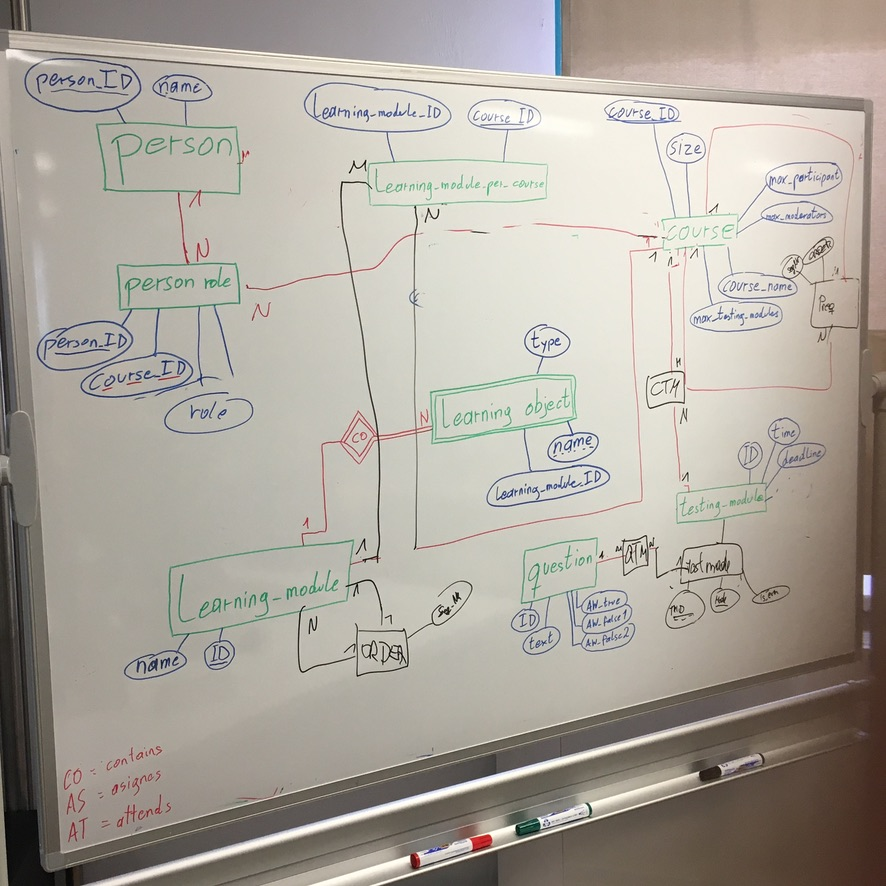
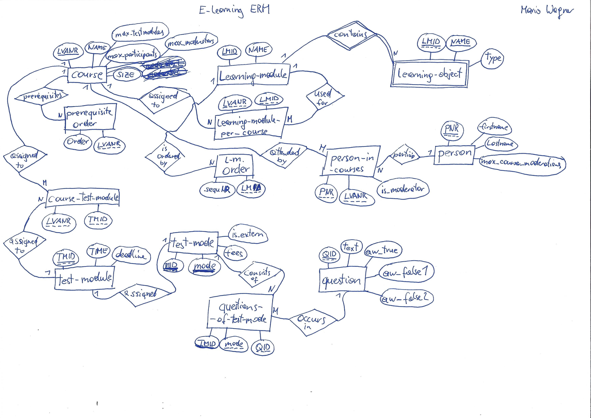

# E-Learning

The data structure of a new e-learning system is to be implemented. 
Draw the following facts in an ER diagram in Chen notation and create a relational 
model ( IGNORE ->No null values are allowed.)
An e-course is clearly identified by a course number (LVANR). In addition, 
a designation (NAME) is stored, a maximum number of participants (MAXIMUM) and the 
amount of time (SIZE) required to complete the course. It is noted which e-courses 
are a prerequisite for which other e-courses.
Learning modules have a name (NAME) and a unique identification number (ID). 
Courses are assigned several learning modules (at least one). Learning modules can 
be used for several courses. For each course the sequence (ORDER) of modules is noted.
Each learning module contains several learning objects (e.g. pictures, texts, videos). 
Learning objects are uniquely identified by the module to which they are assigned 
and their name (NAME). The type (TYPE) is also stored for learning objects.
In some cases, an e-course may also be assigned a test module (maximum). A mode 
(MODE) of a test module is known and a unique name (DEFINITION) - a test module can 
be assigned to several e-courses. MC tests, fees and external exams are exam modules. 
For each submission a deadline (DEADLINE) is also known. A time (TIME) is known for 
each MC test. An MC test consists of several questions. Questions are clearly identified 
by an identification number (FRAGEID). For this purpose, the text (QUESTION), one 
correct (AW TRUE) and two incorrect answers (AW FALSE1, AW FALSE2) must be stored, 
whereby a question can occur in several different MC tests.
Persons are uniquely identified by a personal number (PNR). The name (NAME) is also 
stored. Persons can participate in any number of courses. An e-course, is moderated 
by at least one and at most two persons, whereby one person can moderate a maximum 
of four courses.

### first solution

isNotNull:boolean

e-course
course number (LVANR) 
designation (NAME)
maximum number of participants (MAXIMUM)
the amount of time (SIZE) required to complete the course
which e-courses are a prerequisite for which other e-courses.(isPrerequisiteForWhichCourse)

Learning modules
name (NAME) 
unique identification number (ID). 
Courses are assigned several learning modules (at least one). 
Learning modules can be used for several courses.
 
For each course the sequence (ORDER) of modules is noted.

Each learning module contains several learning objects (e.g. pictures, texts, videos).
 
Learning objects are uniquely identified by the module to which they are assigned 
and their name (NAME). 

The type (TYPE) is also stored for learning objects.
In some cases, an e-course may also be assigned a test module (maximum). A mode 
(MODE) of a test module is known and a unique name (DEFINITION) 

#### Own Solution



(Entity) E-course(LVANR:int, designation:varchar(32),MAXIMUM:int, SIZE:int, isPrerequisiteForWhichCourse:Array, ORDER:Array)
(Entity) Learning Module(ID:int, Name:varchar(32), learningObjects:Array)
(Entity) Learning Object(Learning Modul:Array, Name:varchar(32), Type:varchar(32))
(Entity) Test-Modul(UID:int, Mode:varchar(32))
(Entity) Exam-Modul()
(Entity) Submission()
(Entity) MC-Test()
(Entity) Question()
(Entity) Person()


N e-courses are assigned to M Learning Modules

#### Group Solution



### second solution

#### ERM:



#### textual Notation:

course(**LVANR**:int, NAME:varchar(32), size:int ,max_participants:int, max_moderators:int, max_testmodules:int)

prerequisite-course(ORDERNR:int, *LVANR*:int, *course*:int)

learning-module(**LMID**:int, NAME:varchar(32))

learning-module-per-course(*LVANR*:int,*LMID*:int)

lm-order(sequenceNR:int, *LMID*:int)

learning-object(**NAME**:varchar(32),**LMID**:int, type:varchar(32))

course-test-module(*LVANR*:int, *TMID*:int)

test-module(**TMID**:int, time:int, deadline:timestamp )

test-mode(**TMID**:int, **mode**:varchar(32), is_extern:boolean, fees:int)

questions-of-test-mode(*TMID*:int, *mode*:varchar(32), *QID*:int)

question(**QID**:int, text:varchar(1000), aw_true:varchar(1000), aw_false1:varchar(1000), aw_false2:varchar(1000))

person(**PNR**:int,firstname:varchar(32),lastname:varchar(32), max_course_moderations:int)

person-in-courses(*PNR*:int, *LVANR*:int , is_moderator:boolean)

#### SQL Schema:

[SQL Schema Link](e_learningDB_Schema.pdf)


SQL Code:
```
CREATE TABLE course(LVANR int(8), NAME varchar(32), size int(8) ,max_participants int(2), max_moderators int(1), max_testmodules int(8), PRIMARY KEY(LVAID));

CREATE TABLE prerequisite_course(ORDERNR int(8), LVANR int(8), course int(8));

CREATE TABLE learning_module(LMID int(8), NAME varchar(32), PRIMARY KEY(LMID));

CREATE TABLE learningmodule_per_course(LVANR int(8), LMID int(8));

CREATE TABLE lm_order(sequenceNR int(8), LMID int(8));

CREATE TABLE learning_object( NAME varchar(32), LMID int(8), type varchar(32), PRIMARY KEY(NAME, LMID));

CREATE TABLE course_test_module( LVANR int(8), TMID int(8));

CREATE TABLE test_module( TMID int(8), time int(8), deadline timestamp, PRIMARY KEY(TMID));

CREATE TABLE test_mode( TMID int(8),  mode varchar(32), is_extern boolean, fees int(8), PRIMARY KEY(TMID, mode));

CREATE TABLE questions_of_test_mode( TMID int(8), mode varchar(32), QID int(8));

CREATE TABLE question( QID int(8), text varchar(1000), aw_true varchar(1000), aw_false1 varchar(1000), aw_false2 varchar(1000), PRIMARY KEY(QID));

CREATE TABLE person( PNR int(8), firstname varchar(32), lastname varchar(32), max_course_moderations int(8), PRIMARY KEY(PNR));

CREATE TABLE person_in_courses( PNR int(8), LVANR int(8) , is_moderator boolean, PRIMARY KEY(PNR, LVANR));

```
